# Contribution Defense

Your GitHub contribution graph collapses into a castle wall and defends your profile — one battle every night.

<picture>
  <source media="(prefers-color-scheme: dark)" srcset="examples/dense-dark.svg">
  
</picture>

When your profile loads, a full year of contributions appears in its original graph shape, then gravity pulls every cell down into a brick wall, stacked week by week. Then the goblins arrive. If you committed yesterday, the castle fights back with arrows. If you didn't, you get to watch your wall crumble.

Every scene is an animated SVG rendered daily by GitHub Actions. No JavaScript, no external services, no dependencies.

## Game rules

| Element | Meaning |
|---|---|
| Wall | Your last year of contributions. Each week's active days stack into bricks, keeping GitHub's own color levels |
| Arrows | One arrow per commit you made yesterday. They execute the goblins smashing your wall |
| Castle HP | −10 on a zero-commit day, +commits (max +5) repaired on an active day. Shown as a pixel gauge above the keep |
| Fall | At 0 HP the kingdom falls and a new run starts the next day. Your longest survival is kept as a record |
| Alert | Zero commits yesterday means no arrows. The goblins smash a brick and stroll away unharmed |

HP, run count, and the survival record persist in `state.json`. On first install, the last 8 weeks of activity are replayed so your kingdom starts with a believable chronicle instead of a blank slate.

## The battle

Monsters attack one at a time — the next spawns only when one dies. Broken bricks stay broken for the entire siege; nothing gets repaired mid-run.

1. **March** — a monster walks up to the nearest standing wall column and smashes it brick by brick, advancing only through ground it has already cleared
2. **Artillery** — meanwhile the goblin camp on the far left lobs missiles at random spots on the wall. Each impact carves a plus-shaped hole of five bricks, and any bricks left hanging above the crater drop down under gravity
3. **Arrows** — yesterday's commits (up to 3) execute the monsters one by one. On a defended day the siege ends with the wall cratered but standing
4. **Out of arrows** — the last monster cannot be stopped. The wall falls between hammer and artillery, the monster pounds on the gate, and the camp bombards the castle into rubble
5. **Reset** — only then does the siege restart, and the whole year of contributions falls back into place under gravity, exactly like the opening

The timeline length adapts to your graph, roughly 20–30 seconds per siege.

## Examples

### A wall at full strength — a year of near-daily commits

<picture>
  <source media="(prefers-color-scheme: dark)" srcset="examples/dense-dark.svg">
  
</picture>

All 53 weeks stand six to seven bricks tall. Arrows never stop flying.

### My graph right now — a kingdom being rebuilt

<picture>
  <source media="(prefers-color-scheme: dark)" srcset="examples/current-dark.svg">
  
</picture>

A snapshot of [@rim95dev](https://github.com/rim95dev) as of 2026-08-06. This image does not update — the live version is on [my profile](https://github.com/rim95dev). Only the last 8 weeks of wall are standing; the empty field on the left is a long break from committing. Keep committing and the wall grows leftward.

### Barely any wall — 7 commits in a year

<picture>
  <source media="(prefers-color-scheme: dark)" srcset="examples/sparse-dark.svg">
  
</picture>

Seven lonely bricks, 20 HP, alert raised. The goblins are coming for what's left.

## Set it up on your profile

This repository is a GitHub Action. In your profile repository (`<username>/<username>`):

1. Create `.github/workflows/defense.yml` from [`templates/defense.yml`](templates/defense.yml) — its core is just:

   ```yaml
   - uses: actions/checkout@v4
   - uses: rim95dev/contribution-defense@v1
   # …then commit dist/ and state.json (see the template)
   ```

2. Add this to your profile `README.md`:

   ```html
   <picture>
     <source media="(prefers-color-scheme: dark)" srcset="dist/defense-dark.svg">
     
   </picture>
   ```

3. Push, open the Actions tab, and run the `Contribution Defense` workflow once manually (**Run workflow**). This creates `dist/` and `state.json`, and the image goes live. From then on the battle runs automatically every night (edit the cron to match your timezone).

No token setup required — it runs on the default `GITHUB_TOKEN` and auto-detects the repository owner. To count private-repo activity, enable *Private contributions* in your GitHub profile settings.

Prefer zero dependencies? Copy [`scripts/battle.js`](scripts/battle.js) into your profile repo instead and replace the `uses:` step with `run: node scripts/battle.js` — the script is a single dependency-free file.

### Action inputs

| Input | Default | Meaning |
|---|---|---|
| `github_token` | `${{ github.token }}` | Token used to read the contribution calendar |
| `user` | repository owner | GitHub login to render |
| `output_dir` | `dist` | Where `defense-light.svg` / `defense-dark.svg` are written |
| `state_file` | `state.json` | Path of the persistent battle-state file |

## Customization

Balance constants at the top of `scripts/battle.js`:

| Constant | Default | Meaning |
|---|---|---|
| `HP_LOSS` | 10 | HP lost per zero-commit day |
| `REPAIR_CAP` | 5 | Max HP repaired per day |
| `REPLAY_DAYS` | 56 | Days of history replayed on first install |
| `THEMES` | GitHub palette | Full light/dark color set |

Environment variables:

| Variable | Purpose |
|---|---|
| `DEFENSE_LOGIN` | Render another account's graph (default: repo owner) |
| `DEFENSE_TEST_ARROWS` | Force the arrow count (for testing the choreography) |

Regenerate the showcase scenarios with `node scripts/examples.js` (no token needed).

## How it works

- Fetches a year of contributions (date, count, level) via the GitHub GraphQL `contributionCalendar`
- A state machine in `state.json` accumulates one battle result per day (idempotent — safe to run multiple times a day)
- The whole scene is pure SVG and CSS keyframes. GitHub READMEs never execute JavaScript inside ``, but CSS animations inside an SVG do play, so the gravity intro and the combat choreography are all synchronized CSS timelines
- Renders light and dark variants, switched with `<picture>` to match the viewer's theme

## License

[MIT](LICENSE)
